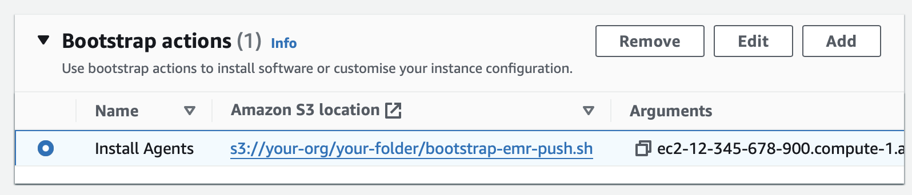

# Xonai Dashboard &middot; [](https://opensource.org/licenses/Apache-2.0) [](code_of_conduct.md)

The Xonai Dashboard is a Grafana-based application to assist Big Data infrastructure optimization initiatives where Spark applications are a dominant cost driver.
It aggregates infrastructure utilization metrics, Spark execution metrics and cloud cost estimates for entire clusters and down to each individual Spark application with the goal of exposing optimization opportunities.

The ingested metrics are parsed and visualized across multiple cross-linked Grafana dashboards:


The Xonai Dashboard can be easily deployed: All UI-related components are installed by executing a single script and clusters are monitored after adding one bootstrap
action that activates metric collector daemons, no code changes are required.

A major classification dimension for monitoring solutions concerns their data ingestion pattern, a pull/polling-based approach (popularized by Prometheus) can be distinguished from a push-based
approach (e.g., Ganglia). Many systems operate exclusively in one mode or have limited support for the alternative method. The Xonai Dashboard supports both approaches and is therefore well suited for tracking
YARN clusters, Databricks clusters, and Kubernetes clusters. The [architecture](./images/Architecture.svg) is modular and integrates several popular open-source projects.

Users can create their own dashboards and the system exposes endpoints for feeding custom metrics (e.g., from a `SparkListener`) to Grafana.
The modular design also allows the integration of managed cloud services that exist for Grafana and several databases. The arrows in the architecture diagrams already indicate that all data flows
between the monitoring components, no information (except for visualizations) leaves the system's environment.

# Xonai Dashboard Installation
The prerequisites chapters cover the configuration of the instance that hosts the UI. After all steps have been completed, we can [SSH](https://docs.aws.amazon.com/AWSEC2/latest/UserGuide/connect-to-linux-instance.html) into the UI server and execute the relevant installation 
script. For example, the UI backend can be configured for EMR with these commands:
``` bash
[ec2-user@ip-123 ~]$ wget https://github.com/xonai-computing/xonai-dashboard/tree/master/scripts/install-ui-emr.sh # Download script
[ec2-user@ip-123 ~]$ bash install-ui-emr.sh
```

# Monitoring Clusters
The [cluster bootstrap scripts](./scripts/) automate the installation of collector daemons that periodically transmit or publish telemetry data and the configuration of Spark's internal metric system.
The relevant script should be copied into an S3 bucket or Databricks workspace file that tracked clusters are able to access. For example, the following bootstrap action configures an EMR cluster for 
monitoring:



After the bootstrapping phase completes, the UI backend harvests the metrics and passes them to Grafana upon request. The usage [page](./docs/usage.md) covers the dashboard functionality in more detail.

# Supported Platforms and Resource Links
The table below shows all supported platforms and points to the relevant platform-specific resources. The prerequisites and setup documents provide step-by-step installation and usage instructions
for the Xonai Dashboard.

| Platform          | Prerequisites Document                        | Setup Document                           | UI Installation Script                                   | Cluster Bootstrap Script                                  |
|-------------------|-----------------------------------------------|------------------------------------------|----------------------------------------------------------|-----------------------------------------------------------|
| Amazon EMR        | [Prerequisites](./docs/prerequ-emr.md)        | [Setup](./docs/setup-emr.md)             | [install-ui-emr.sh](./scripts/install-ui-emr.sh)         | [bootstrap-emr-push.sh](./scripts/bootstrap-emr-push.sh)  |
| Databricks on AWS | [Prerequisites](./docs/prerequ-aws-dbx.md)    | [Setup](./docs/setup-aws-dbx.md)         | [install-ui-aws-dbx.sh](./scripts/install-ui-aws-dbx.sh) | [bootstrap-aws-dbx.sh](./scripts/bootstrap-aws-dbx.sh)    |
|                   |                                               |                                          |                                                          |                                                           |

# Contributing

The Xonai Dashboard was just released and Xonai plans to bring many new features, such as supporting new cloud providers and making it better at pinpointing issues in monitored clusters.
Contributing with bugfixes, improvements and suggestions for new features are very welcome.

## Code of Conduct

Xonai has adopted a Code of Conduct for which all project participants are expected to adhere to. Please read [the full text](./CODE_OF_CONDUCT.md) to understand the implications.

## License

Xonai Dashboard is [Apache 2.0 Licensed](./LICENSE).
