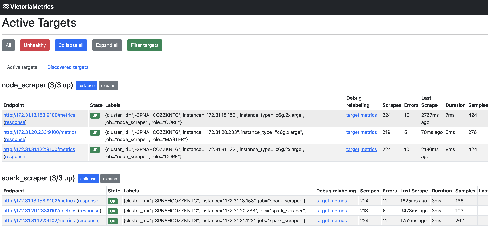

# UI Tests
This chapter presents a number of tests and sanity checks for the various UI components.

## Daemon Introspection
All UI components and metric collectors are installed as systemd services which are introspected and modified with the [systemctl](https://www.man7.org/linux/man-pages/man1/systemctl.1.html) command.
The `status` subcommand for example can be used to view the runtime statuses and logs of the various daemons. On the Grafana instance, the UI daemons are checked with the following commands:
``` shell
[ec2-user@ip-123 ~]$ sudo systemctl status grafana-server # check status of Grafana service
[ec2-user@ip-123 ~]$ sudo systemctl status victoria # check status of database service
[ec2-user@ip-123 ~]$ sudo systemctl status xonai_grafana # check status of backend service
```

On a cluster node, the metric collector daemons can be introspected as follows:
``` shell
[hadoop@ip-456 ~]$ sudo systemctl status node_exporter # check status of metric collector for node-level metrics
[hadoop@ip-456 ~]$ sudo systemctl status metrics_agent # check status of metric collector for Spark metrics (only push mode)
[hadoop@ip-456 ~]$ sudo systemctl status telegraf # check status of metric collector for Spark metrics (only pull mode)
```

## Data Path Checks
Every system service referenced in the preceding section also exposes an HTTP interface that returns a message or metric data when contacted. On the UI server, the
relevant HTTP ports are:
``` shell
[ec2-user@ip-123 ~]$ curl localhost:3000 # contact Grafana, should return "Found"
[ec2-user@ip-123 ~]$ curl localhost:8428 # contact database, should return "Single-node VictoriaMetrics"
[ec2-user@ip-123 ~]$ curl localhost:8000 # contact backend server, should return "200"
```

The requests on a cluster node have the following form:
``` shell
[hadoop@ip-456 ~]$ curl localhost:9100/metrics # request current node-level metrics, should return data in Prometheus format 
[hadoop@ip-456 ~]$ curl localhost:8429 # contact Spark metric collector (only push mode), should return "vmagent"
[hadoop@ip-456 ~]$ curl localhost:9102 # contact Spark metric collector (only pull mode), returns "Telegraf Output Plugin" 
```

When some of these commands are issued from a suitable remote instance, the firewall modifications that are specified in the prerequisites chapter can be verified. If the correct ports were opened,
the following curl commands return a response immediately, otherwise they get stuck and time out. Under the push approach, a cluster node must be allowed to contact the UI server on port `8428`, so the
next command should return the same response as its local counterpart:
``` shell
[hadoop@ip-456 ~]$ curl $UI_IP4_DNS:8428 # contact UI backend from cluster node (only push mode)
```

The roles are reversed when metrics are pulled in, a request issued on the UI server must receive a response from the cluster node:
``` shell
[ec2-user@ip-123 ~]$ curl $EMR_NODE_IP4:9100/metrics # request cluster node metrics 
[ec2-user@ip-123 ~]$ curl $EMR_NODE_IP4:9102 # contact Spark metric collector, returns "Telegraf Output Plugin" 
```

## Grafana Data Source Checks
The installation script automatically configures two Grafana data sources whose connections can be tested in the UI: The detail pages for the Prometheus and JSON plugins can be opened in
the data sources window (`$UI_IP4_DNS:3000/connections/datasources`). After clicking on the "Save & test" buttons at the bottom of the respective detail pages, green check marks should occur. Error messages
would indicate that the database or xonai_grafana daemons are not running or that their Grafana connections are misconfigured.

## UI Connection Checks
The metric ingestion and connection between Grafana and the database can be verified with the `Test Setup` dashboard after manually inserting a few metric samples in Prometheus exposition format:
``` shell
[ec2-user@ip-123 ~]$ curl -d 'test_timeseries{label_key="value_key"} 10' -X POST 'localhost:8428/api/v1/import/prometheus' # pause for around 15 seconds between commands
[ec2-user@ip-123 ~]$ curl -d 'test_timeseries{label_key="value_key"} 101' -X POST 'localhost:8428/api/v1/import/prometheus'
[ec2-user@ip-123 ~]$ curl -d 'test_timeseries{label_key="value_key"} 202' -X POST 'localhost:8428/api/v1/import/prometheus'
[...]
```

These commands create a new time series called `test_timeseries` with the timestamped values 10, 101, 202, ... in the database. After one or two minutes, a plot that rises from left to right should be
displayed in the `Test Setup` board which proves that database entries are sent correctly to Grafana. A similar visualization is available in the database's UI at
`$UI_IP4_DNS:8428/vmui`, port `8428` must have been opened before this interface can be
accessed from a remote machine. The test time series can be plotted there by first entering its name `test_timeseries` under the "Query" tab and then clicking on the "Execute Query" button.

## Service Discovery Validation
If the UI was installed in pull mode, the nodes that are queried during the metric collection process are listed at `$UI_IP4_DNS:8428/targets` (port `8428` must be open). In the "node_scraper" and 
"spark_scraper" tables, the rows for the nodes of an active
cluster that was bootstrapped with our pull script should have a green "Up" state label. This indicates that the metric endpoints on the cluster nodes are contacted successfully and their data is
fetched. In case the state column has a "Down" label for the relevant scrape targets, the instance profile and security group settings should be compared with the requirements mentioned
on the prerequisites [page](./prerequ-emr.md).


