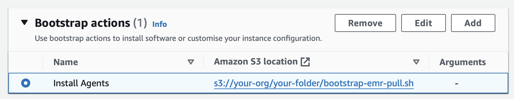

# Miscellaneous
This page describes additional installation options and usage information. 

## Additional Installation Settings
### Limiting AWS Regions
The `AWS_REGIONS` environment variable encodes the AWS region(s) where clusters will be launched and will reduce the number of AWS API calls performed during the UI installation. If unset, 
the installation scripts access cost data for all AWS regions which prolongs their completion.
<br> Commas are used as delimiters when more than one region needs to be specified (e.g., `us-east-1,us-east-2,eu-central-1`), a region summary table is included
[below](#aws-regions). The following command limits the regions to "US East (N. Virginia)":
``` bash
[ec2-user@ip-123 ~]$ export AWS_REGIONS=us-east-1 # limits cost data access to us-east-1 region
 ```
Several cloud dashboards display cost estimations and have a region variable for dynamically switching the pricing info that is loaded. The [usage](./usage.md#changing-grafana-variables) 
chapter explains how these drop-down lists can be truncated after the UI installation.

### Pull Mode Activation
By default, the installation scripts configure the UI components in push mode. The push and pull ingestion patterns require slightly different network configurations as their data paths differ.
This is also reflected in the architecture [picture](../images/Architecture.svg), the pull diagram contains more data flow arrows that are bidirectional.

#### Security Group Changes
Under the pull approach, the security group of the Grafana
server does not require any `8428` ingress [rules](./prerequ-emr.md#adjusting-inbound-traffic) whose sources specify an EMR security group. Instead, the metric endpoints on the cluster nodes need 
to be reachable from the UI instance, so two pull ports in the security groups of the tracked clusters must be enabled. This can be done in the existing EMR-managed security groups for the master and
core/task nodes. Alternatively, a custom group can be created and then attached to new clusters. In any case, the security groups of the primary node and core/task nodes must have the following 
inbound rule pair:
- Allow custom TCP port `9100` for the security group of the UI server as source (`UiBackendSecGroup` in our example).
- Allow custom TCP port `9102` for the security group of the UI server as source (`UiBackendSecGroup` in our example).

The screenshot below shows a custom group called `UiEmrSecGroup` with these two inbound rules.


In our example, this group will be chosen as an additional security group for both the master and core/task nodes when EMR clusters are created. Additional security groups can be selected on the 
right side of the "EC2 security groups (firewall)" section in a cluster's "Networking" panel. This topic is also covered in the official EMR [guide](https://docs.aws.amazon.com/emr/latest/ManagementGuide/emr-additional-sec-groups.html).


#### Installation and Bootstrap Action
To configure the UI backend in pull mode, a variable `INGESTION_MODE` with the value `pull` needs to be set before [bootstrap-emr-pull.sh](../scripts/bootstrap-emr-pull.sh) is executed:
``` bash
[ec2-user@ip-123 ~]$ export INGESTION_MODE=pull # activates pull ingestion
 ```
The [AWS_REGIONS](#limiting-aws-regions) variable has an additional effect when the pull ingestion gets activated, its value will be configured as the polling region. If it is not set, an additional API call is made during the
pull mode installation that tries to determine the UI instance's region. This response is then used as the scrape region, assuming that EMR clusters will be launched into the same region.

The script [bootstrap-emr-pull.sh](../scripts/bootstrap-emr-pull.sh) needs to be referenced in a bootstrap action: When creating a cluster, paste its S3 URI
into the "Script location" field of the "Add bootstrap action" window, no additional arguments like peer addresses are required:

 

### Anonymous Access and Embeddings
Grafana's default password [authentication](https://grafana.com/docs/grafana/latest/setup-grafana/configure-security/configure-authentication/#configure-authentication) can be disabled by declaring an
`ALLOW_ANONYMOUS` environment variable:
``` bash
[ec2-user@ip-123 ~]$ export ALLOW_ANONYMOUS=true # remove login
 ```
With this setting, the property line `enabled = true` gets written into the `[auth.anonymous]` section of the Grafana config file which is located at `/etc/grafana/grafana.ini`.

Grafana objects can be [embedded](https://grafana.com/blog/2023/10/10/how-to-embed-grafana-dashboards-into-web-applications/) into web applications like the Spark History Server. The installation
script enables this functionality when the `ALLOW_EMBEDDING` variable is set:
``` bash
[ec2-user@ip-123 ~]$ export ALLOW_EMBEDDING=true # enables the embedding of Grafana
 ```
This will add one or two properties to the `[security]` section of the configuration file: The key `allow_embedding` is set to `true` and, unless anonymous access is activated, the key
`cookie_samesite` is set to `disabled`. The security implications of these changes are described [here](https://grafana.com/docs/grafana/latest/setup-grafana/configure-grafana/#cookie_samesite).

The configuration of an existing installation can be changed by first stopping the Grafana daemon with the command `sudo systemctl stop grafana-server`. After all modifications to the configuration
file `/etc/grafana/grafana.ini` have been made, the daemon needs to be started again via `sudo systemctl start grafana-server`.

## AWS Regions
All relevant AWS [regions](https://docs.aws.amazon.com/general/latest/gr/emr.html) are shown in the table below:

<details>
<summary>AWS regions (click me):</summary>

| Region         | Region Name               |
|----------------|---------------------------|
| us-east-1      | US East (N. Virginia)     |
| us-east-2      | US East (Ohio)            |
| us-west-1      | US West (N. California)   |
| us-west-2      | US West (Oregon)          |
| af-south-1     | Africa (Cape Town)        |
| ap-east-1      | Asia Pacific (Hong Kong)  |
| ap-south-1     | Asia Pacific (Mumbai)     |
| ap-south-2     | Asia Pacific (Hyderabad)  |
| ap-southeast-1 | Asia Pacific (Singapore)  |
| ap-southeast-2 | Asia Pacific (Sydney)     |
| ap-southeast-3 | Asia Pacific (Jakarta)    |
| ap-southeast-4 | Asia Pacific (Melbourne)  |
| ap-northeast-1 | Asia Pacific (Tokyo)      |
| ap-northeast-2 | Asia Pacific (Seoul)      |
| ap-northeast-3 | Asia Pacific (Osaka)      |
| ca-central-1   | Canada (Central)          |
| eu-central-1   | Europe (Frankfurt)        |
| eu-central-2   | Europe (Zurich)           |
| eu-west-1      | Europe (Ireland)          |
| eu-west-2      | Europe (London)           |
| eu-west-3      | Europe (Paris)            |
| eu-south-1     | Europe (Milan)            |
| eu-south-2     | Europe (Spain)            |
| eu-north-1     | Europe (Stockholm)        |
| il-central-1   | Israel (Tel Aviv)         |
| me-south-1     | Middle East (Bahrain)     |
| me-central-1   | Middle East (UAE)         |
| sa-east-1      | South America (São Paulo) |

</details>

## Activated Node Exporter Collectors
The following table lists the node_exporter collectors that our bootstrapping scripts activate. This set is smaller than the [default](https://github.com/prometheus/node_exporter#enabled-by-default) one and significantly reduces the number of metric time 
series that have to be sent over the network and stored. Additional collectors can be activated by changing the `DISABLED_COLLECTORS` variable in our 
bootstrap [scripts](../scripts).

<details>
<summary>Activated collectors (click me):</summary>

| Collector Name |
|----------------|
| bcache         |
| cpu            |
| cpufreq        |
| diskstats      |
| edac           |
| filefd         |
| filesystem     |
| infiniband     |
| ipvs           |
| loadavg        |
| meminfo        |
| netclass       |
| netdev         |
| nfs            |
| nfsd           |
| nvme           |
| uname          |
| vmstat         |

</details>