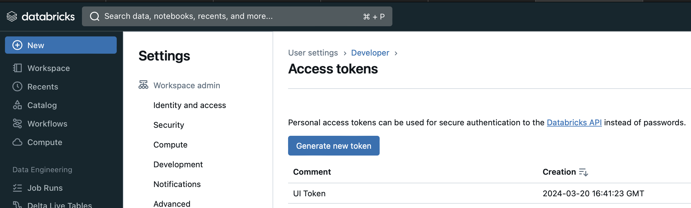
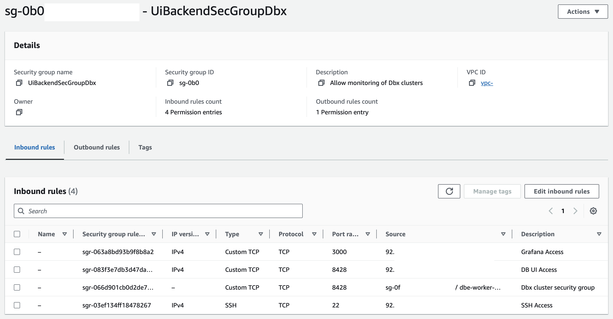
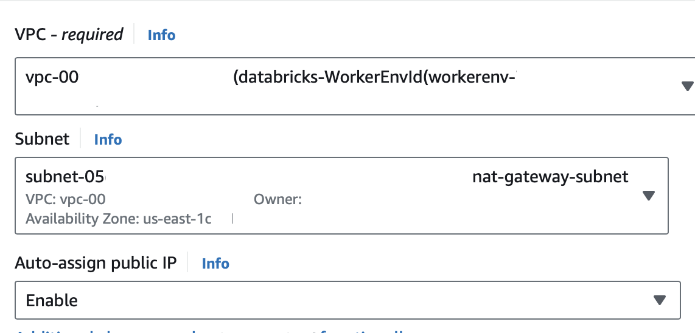
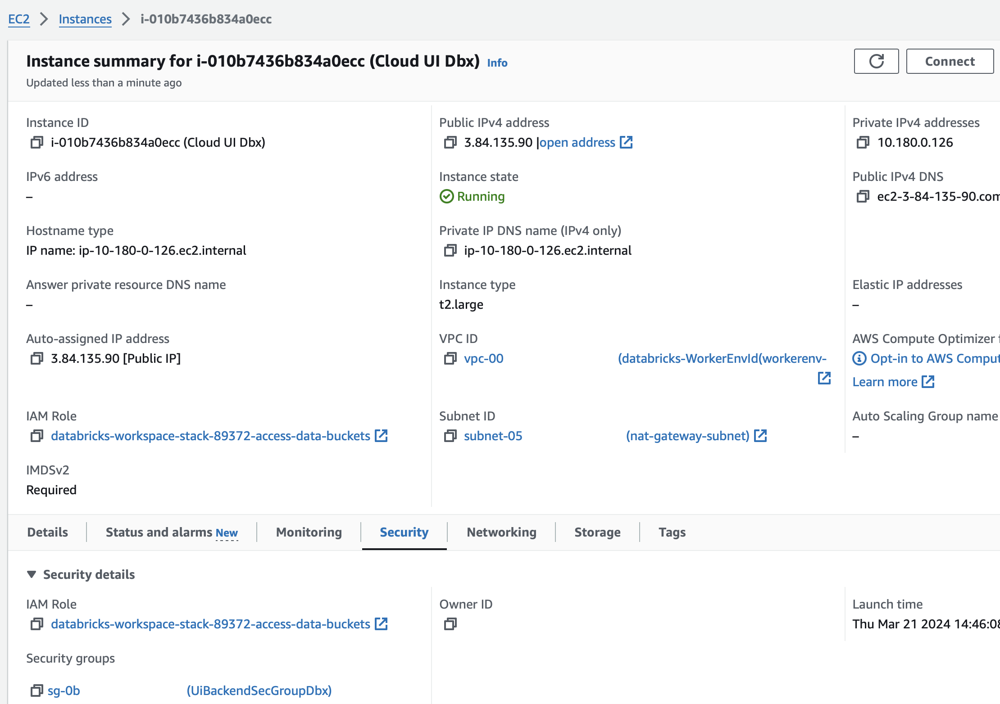

# Prerequisites on AWS for Databricks
A few permissions need to granted so that the observability backend can request cluster metadata from Databricks APIs and ingest metrics from cluster nodes. All changes mentioned in this chapter need
to be made just once.

## Databricks Authentication
Some dashboard panels rely on API data and their requests need to be verified by Databricks. The most convenient identity verification strategy consists in using Databricks [native 
authentication](https://databricks-sdk-py.readthedocs.io/en/latest/authentication.html#databricks-native-authentication) with a personal access token. The token creation process is described [here](https://docs.databricks.com/en/dev-tools/auth/pat.html#databricks-personal-access-tokens-for-workspace-users).

After a suitable token has been created, it can be used in various ways for the authentication of tools like the Xonai Dashboard, the native authentication [page](https://databricks-sdk-py.readthedocs.io/en/latest/authentication.html#databricks-native-authentication) 
mentions more details. In the most straightforward approach, two environment variables are declared:
- `DATABRICKS_HOST`: Holds the Databricks workspace instance URL from where tracked clusters will be launched, should begin with "https://" (e.g., _https://dbc-12345678-90a1.cloud.databricks.com_)
- `DATABRICKS_TOKEN`: Holds the access token (e.g., _abc123ab45ae6adaf789aa0a00000000000_)

## Security Group Creation
The firewall rules mentioned in the next section can be added to an existing security group (like `dbe-worker-...-unmanaged`) that is then chosen during the UI instance creation. Alternatively, a
new security group can be created with them: The "Security Groups" window can be opened from the "Network & Security" area of the EC2 console. After clicking on "Create security group", multiple fields
need to be completed: The "Basic details" section asks for a name (e.g., `UiBackendSecGroupDbx`), description, and VPC. If the "`8428` ingress rule" mentioned in the following section will be restricted
to inbound traffic originating from a Databricks security group, then the VPC that Databricks clusters use (like `vpc-123456 (databricks-WorkerEnvId)`) must be chosen here. The "Inbound rules" list
needs to be populated with the following entries:

### Adjusting Inbound Traffic
The "Inbound rules" table of the UI instance's security group must contain the following entries:
- Allow SSH access (port `22`) with the user's IP address ("My IP") or known CIDR blocks/security groups as source: One must obviously SSH into a machine first before executing a script on it. Several
  validation checks that are described on the validation [page](./checks.md) can also be performed on the UI server post installation.
- Allow custom TCP port `3000` with the user's IP address ("My IP") or known CIDR blocks/security groups as source: This is required for accessing the Grafana UI which is available on port 3000 by default.
- Allow custom TCP port `8428` for a security group attached to Databricks clusters as source.
- (optional) Allow custom TCP port `8428` with the user's IP address ("My IP") or known CIDR blocks/security groups as source: This entry is similar to the previous Grafana rule and only required if
  the user wants to access the UI of the underlying database.

In the preceding snapshot, three entries of the traffic source column start with `92.` which was the first segment of the author's personal IP address. Only the source column of the
"`8428` ingress rule" specifies the Databricks security group and begins with `sg-`.

Databricks security groups allow all outbound traffic by default, so no changes to them should be required.

## Launching the UI Instance
The instance that will host the UI can now be [launched](https://docs.aws.amazon.com/AWSEC2/latest/UserGuide/EC2_GetStarted.html#ec2-launch-instance) from the EC2 console. "Amazon Linux 2023 AMI"
needs to be selected as machine image and the server must have a public domain name (like _ec2-123-45-678-910.compute-1.amazonaws.com_), so the "Auto-assign public IP" option in the "Network settings"
panel has to be set to "Enable". Databricks has recently enabled secure cluster [connectivity](https://docs.databricks.com/en/security/network/classic/secure-cluster-connectivity.html) for new workspaces by default which may have
consequences for the choice of the UI server's subnet: With this network configuration, instances that are launched into the Databricks VPC receive no public IP addresses except for those in the 
subnet with the NAT [gateway](https://docs.aws.amazon.com/vpc/latest/userguide/vpc-nat-gateway.html). If secure connectivity is enabled and the target of the "`8428` ingress rule" (see above) specifies
a Databricks security group, then the UI instance must be placed into the NAT gateway subnet:

If a security group with the aforementioned [rules](#adjusting-inbound-traffic) was already created in the same VPC (e.g., `UiBackendSecGroupDbx`), it is available in the drop-down menu under the 
"Select existing security group" option inside the "Network settings" panel. The picture below shows a running UI server with the described settings:

In case a custom security group like `UiBackendSecGroupDbx` was not created and selected, the UI firewall rules need to be added to whatever group is associated with the active UI sever:
All security groups of a running EC2 instance are listed under the "Security" tab of its detail page. One group needs to be opened so that its inbound rules table can be augmented with the entries 
that were mentioned in the [Adjusting Inbound Traffic](#adjusting-inbound-traffic) section.

From now on, the placeholder `UI_IP4_DNS` will refer to the public IPv4 DNS of the UI server. When an EC2 instance is restarted, its addresses change, so users must avoid using outdated backend
addresses in the future.
