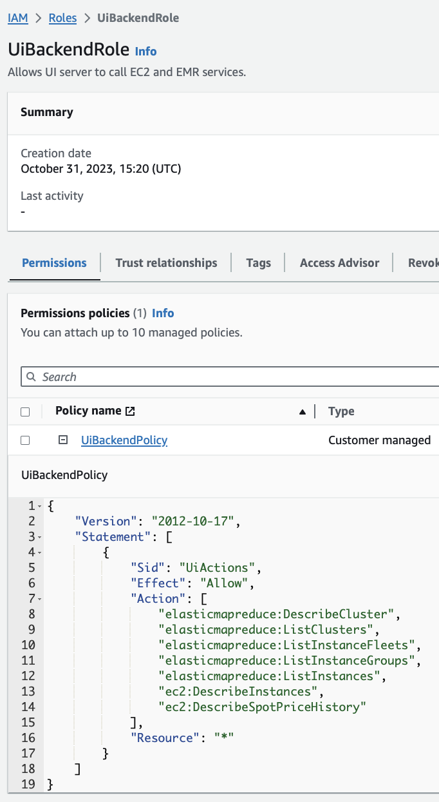
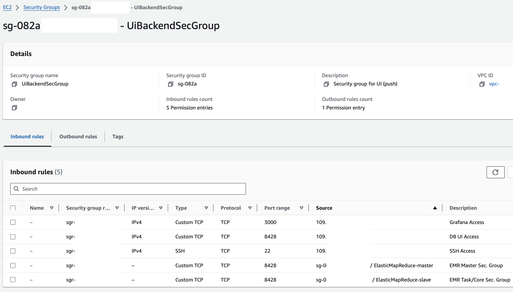
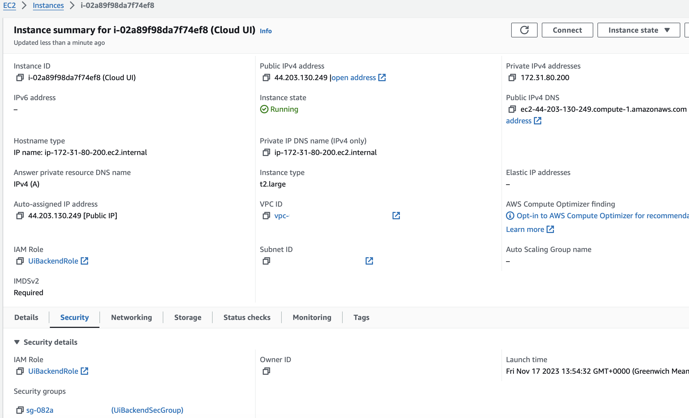

# Prerequisites on AWS for EMR
A few permissions need to granted so that the observability backend can request cluster metadata from AWS APIs and ingest metrics from cluster nodes. All changes mentioned in this chapter need
to be made just once: Existing AWS entities can be augmented or, alternatively, new objects can be created and then associated with the UI instance and monitored clusters.

## IAM Role Adjustments
The IAM profile of the Grafana server should allow the listing and description of EMR clusters, EC2 instances, and spot price histories. Two AWS-managed access policies that permit these
actions already exists, namely `AmazonEMRReadOnlyAccessPolicy_v2` and `AmazonEC2ReadOnlyAccess`. Alternatively, a more fine-grained policy can be used, its definition and attachment are described in
the next two subsections that can be skipped in case the managed policies will be used. AWS's [user guide](https://docs.aws.amazon.com/IAM/latest/UserGuide/access_policies_create-console.html)
explores these topics in more detail.

### Inline Policy Creation
In the _Identity and Access Management_ (IAM) console, the policies window opens after clicking on the "Policies" link in the "Access Management" section. The orange "Create policy" button leads
to the "Specify Permissions" menu where the blue JSON button switches the policy editor mode. The following JSON document can now be copy-pasted into the editor.

<details>
<summary>Inline Policy (click me):</summary>

```json
{
  "Version": "2012-10-17",
  "Statement": [
    {
      "Sid": "UiActions",
      "Effect": "Allow",
      "Action": [
        "elasticmapreduce:DescribeCluster",
        "elasticmapreduce:ListClusters",
        "elasticmapreduce:ListInstanceFleets",
        "elasticmapreduce:ListInstanceGroups",
        "elasticmapreduce:ListInstances",
        "ec2:DescribeInstances",
        "ec2:DescribeSpotPriceHistory"
      ],
      "Resource": "*"
    }
  ]
}
```
</details>

The "Next" button leads to the "Review and create" page where a descriptive name like `UiBackendPolicy` needs to be entered before the "Create policy" button can be clicked.

### IAM Role Creation
New roles are also created from the IAM console's "Access Management" section: A click on the "Roles" link opens a window with an orange "Create role" button. It forwards to the role creation
page where "AWS service" needs to be selected as trusted entity type and "EC2" as "Use case". The "Next" button leads to the second step in which permissions need to be added. The name of the recently
created policy (e.g., `UiBackendPolicy`) should be entered into the search field and the box of the search result must be ticked. On the next page, a suitable role name like `UiBackendRole` has to be
provided before the "Create role" button can be clicked.

The following screenshot shows the newly created IAM role `UiBackendRole` with the inlined policy `UiBackendPolicy`. In our running example, this AWS entity will be associated with the UI server.



## Adjusting Security Groups
After obtaining the relevant service access permissions, the network connectivity can now be addressed: The AWS firewall rules mentioned below can be added to an existing/"ad-hoc created" security
group that will be assigned to the UI server or a new security group can be created with them before the instance is even launched. The latter is covered in the following subsection.

### Security Group Creation
The "Security Groups" window can be opened from the "Network & Security" area of the EC2 console. After clicking on "Create security group", multiple fields need to be completed: The "Basic details"
section asks for a name (e.g., `UiBackendSecGroup`), description, and VPC. The VPC that is entered here must also be used for the UI server, otherwise the new group will not be available for
selection. The "Inbound rules" list needs to be populated with the following entries:

### Adjusting Inbound Traffic
The "Inbound rules" table of the UI instance's security group must contain the following entries:
- Allow SSH access (port `22`) with the user's IP address ("My IP") or known CIDR blocks/security groups as source: One must obviously SSH into a machine first before executing a script on it. Several
  validation checks that are described on the validation [page](./checks.md) can also be performed on the UI server post installation.
- Allow custom TCP port `3000` with the user's IP address ("My IP") or known CIDR blocks/security groups as source: This is required for accessing the Grafana UI which is available on port 3000 by default.
- Allow custom TCP port `8428` for a security group attached to the EMR master node as source. The security group IDs that are associated with an EMR cluster are displayed under "EC2 security groups
(firewall)" in the "Network and security" panel of its details page.
- Allow custom TCP port `8428` for a security group of the EMR worker/task nodes as source.
- (optional) Allow custom TCP port `8428` with the user's IP address ("My IP") or known CIDR blocks/security groups as source: This entry is similar to the previous Grafana rule and only required if
  the user wants to access the UI of the underlying database.



In the preceding snapshot, the first three entries in the traffic source column start with `109.` which was the initial segment of the author's personal IP address. Network ingress to port `8428` 
was enabled for the two EMR-managed security groups which all of our monitored clusters will use by default. Correspondingly, the traffic source entries for these two inbound rules start with `sg-` 
and not with an IP address like `109.*`.

By default, the EMR-managed security groups allow all outbound traffic, so no changes to them should be required.

## Launching the UI Instance
The instance that will host the UI can now be [launched](https://docs.aws.amazon.com/AWSEC2/latest/UserGuide/EC2_GetStarted.html#ec2-launch-instance) from the EC2 console. "Amazon Linux 2023 AMI"
needs to be selected as machine image and the server must have a public domain name (like _ec2-123-45-678-910.compute-1.amazonaws.com_) so the "Auto-assign public IP" option in the "Network settings"
panel has to be set to "Enable". From now on, the placeholder `UI_IP4_DNS` will refer to the public IPv4 DNS of this UI server. When an EC2 instance is restarted, its addresses change, so users must avoid
using outdated backend addresses in the future.

If a custom IAM Role was defined during the prerequisites phase, it can be directly selected at the bottom of the instance launch window: Its name (e.g., `UiBackendRole`) should appear in the "IAM instance profile" drop-down menu of the
"Advanced details" panel. The same applies to the firewall configuration: If a security group with the aforementioned [rules](#adjusting-inbound-traffic) was already created in the same VPC (e.g., `UiBackendSecGroup`),
it is available in the drop-down menu under the "Select existing security group" option inside the "Network settings" panel. The picture below shows a running UI server with the described settings:



In case a custom IAM role or security group were not created, the next subsection cannot be skipped as it explains how the required permissions can be added to an instance after its launch:

### Augmenting IAM Roles and Security Groups
As depicted in the previous screenshot, the IAM role and security groups of a running instance can be opened under the "Security" tab in its detail page. A click on the IAM role link opens a window
in the IAM console, the relevant section is the "Permission policies" panel under the "Permissions" tab. The two AWS-managed policies mentioned at the beginning of this chapter can now be attached by
clicking on the "Add permission" button and on "Attach policies". A long policy list will appear, the names `AmazonEMRReadOnlyAccessPolicy_v2` and `AmazonEC2ReadOnlyAccess` need to be entered into the
search field and the box for each of the two search results must be ticked. After clicking on "Add permissions", the two policy names will now appear in the permission list of the IAM role.

All security groups of a running EC2 instance are listed under the "Security" tab of its detail page. One group needs to be opened so that its inbound rules table can be augmented with the relevant
entries that were mentioned in the [Adjusting Inbound Traffic](#adjusting-inbound-traffic) section.
