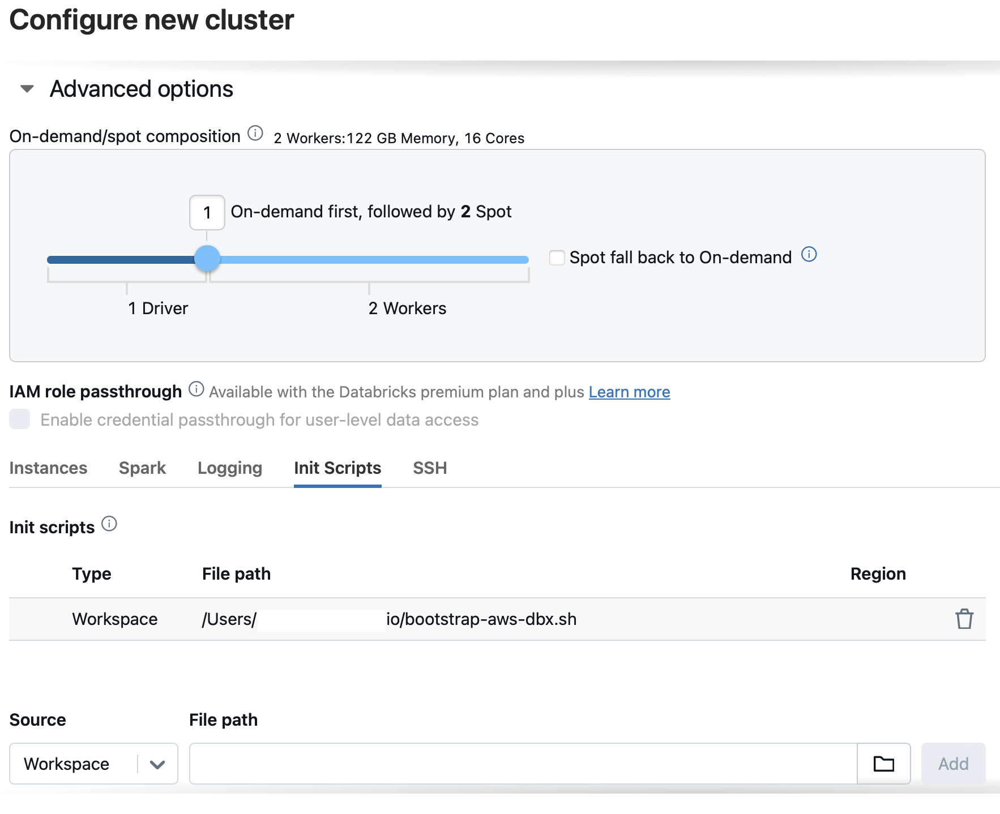
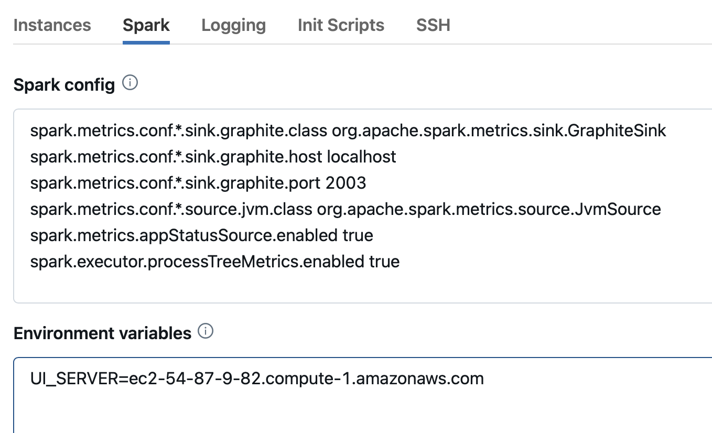

# Dashboard Installation and Cluster Configuration for Databricks on AWS

The [prerequisites](./prerequ-aws-dbx.md) chapter covers the configuration of the instance that hosts the Xonai Dashboard. After all steps have been completed,
we can [SSH](https://docs.aws.amazon.com/AWSEC2/latest/UserGuide/connect-to-linux-instance.html) into this UI server and execute the installation script.

## UI Installation
Before the installation script is executed on the UI instance, the two Databricks authentication variables [mentioned](./prerequ-aws-dbx.md#databricks-authentication) in the prerequisites page need to 
be declared as follows:
``` bash
[ec2-user@ip-123 ~]$ export DATABRICKS_HOST=https://dbc-12345678-90a1.cloud.databricks.com
[ec2-user@ip-123 ~]$ export DATABRICKS_TOKEN=abc123ab45ae6adaf789aa0a00000000000 # ToDo: Change value
```

A few optional environment variables that influence the installation process and enable specific Grafana functionalities can be declared, they are described in the [addendum](./misc.md/#additional-installation-settings).
We recommend the definition of the `AWS_REGIONS` [variable](./misc.md/#limiting-aws-regions) that encodes the AWS region(s) where clusters will be launched. If unset, the script accesses cost data for 
all AWS regions which prolongs its completion.

The script [install-ui-aws-dbx.sh](../scripts/install-ui-aws-dbx.sh) can now be downloaded and executed, it manages all installation and configuration steps:
``` bash
[ec2-user@ip-123 ~]$ wget https://github.com/xonai-computing/xonai-dashboard/tree/master/scripts/install-ui-aws-dbx.sh # Download script
[ec2-user@ip-123 ~]$ bash install-ui-aws-dbx.sh
```
The final message "Installation of Xonai Dashboard completed" indicates that our Grafana dashboards can be accessed as described in the [usage](./usage.md) document, several post installation checks
are mentioned in the testing [chapter](./checks.md). Cluster metadata and cost estimations should already be displayed in the cluster list boards but no node-level or Spark metrics are available yet.
This will change after bootstrapping a Databricks cluster with our init script which is the topic of the next section.

## Databricks Cluster Configuration
The bootstrap script [bootstrap-aws-dbx.sh](../scripts/bootstrap-aws-dbx.sh) automates the installation of collector daemons that periodically transmit telemetry data. It can be stored and referenced 
in multiple ways, for example as a [Workspace file](https://docs.databricks.com/en/files/workspace.html) whose path is then added to the
[initialization script](https://docs.databricks.com/en/init-scripts/cluster-scoped.html#configure-a-cluster-scoped-init-script-using-the-ui) list. The "Init Scripts" tab can be found in the 
"Advanced Options" section at the bottom of a cluster configuration page:

 

The initialization script section does not provide an option for specifying additional arguments, so the IPv4 DNS of the UI server (for example _ec2-54-87-9-82.compute-1.amazonaws.com_) needs to be 
specified as an environment variable `UI_SERVER`: This variable can be declared directly in the bootstrap [script](../scripts/bootstrap-aws-dbx.sh) or, alternatively, entered into the "Environment 
variables" window under the "Spark" tab:

 

The preceding screenshot also shows the properties for configuring Spark's internal metric system. The following key-value pairs need to be added to the "Spark config" window:
```bash
spark.metrics.conf.*.sink.graphite.class org.apache.spark.metrics.sink.GraphiteSink
spark.metrics.conf.*.sink.graphite.host localhost
spark.metrics.conf.*.sink.graphite.port 2003
spark.metrics.appStatusSource.enabled true
spark.metrics.conf.*.source.jvm.class org.apache.spark.metrics.source.JvmSource
spark.executor.processTreeMetrics.enabled true
```
